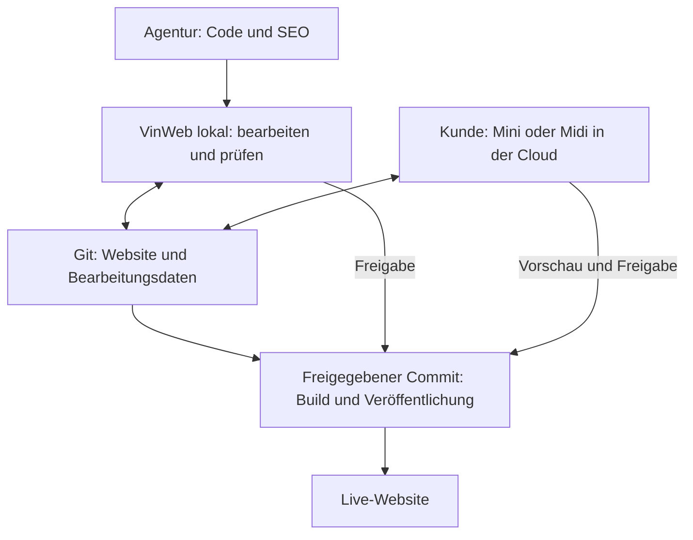

# VinWeb, VinWeb Mini und VinWeb Midi – Prüfung und Weiterentwicklung

Stand: 9. September 2026. Grundlage: die drei bereitgestellten Entwickler-ZIPs, deren ENTWICKLER-CHECK.md sowie das zusätzlich hochgeladene KONZEPT.md. Dies ist ein Prüfbericht, kein Patchpaket. Die Originalquellen wurden nicht verändert.

## 1. Ergebnis für euren tatsächlichen Ablauf

Euer Modell ist sinnvoll: Die Agentur gestaltet und programmiert die Website, reichert sie vorab mit SEO an, erledigt in VinWeb lokal die letzten Anpassungen und Prüfungen und gibt den Stand zur Veröffentlichung frei. Danach bearbeitet der Kunde seine Website über Mini oder Midi in der Cloud. VinWeb ist damit das Agenturwerkzeug zur Fertigstellung und Betreuung; Mini/Midi sind die Kundenoberfläche für die anschliessende Inhaltspflege.

Der vorhandene Code ist eine brauchbare Ausgangsbasis für diese Aufteilung. Für eine Kundenfreigabe fehlen aber sowohl Sicherheitsgrenzen als auch ein vollständiger, zuverlässiger Weg von der Kundenänderung zur veröffentlichten Website. Mehrere bereits vorhandene Funktionen haben reproduzierbare Fehler. Ein öffentlich erreichbarer Cloudbetrieb des unveränderten Pakets ist deshalb noch nicht freigabefähig.

Ein Frameworkwechsel oder eine vollständige Neuprogrammierung der Agenturanwendung ist dafür nicht erforderlich. Express und Vanilla-JS können bleiben. Der Aufwand liegt vor allem in den Bearbeitungsrechten, der Datenhaltung, der Veröffentlichung und der Betriebssicherheit.

Mini und Midi sind bereits ein gemeinsamer Codebestand. Der Bytevergleich aller entpackten Dateien zeigt Unterschiede ausschliesslich in `einstellungen.json` und `PAKET-HINWEIS.md`. Die hier genannten gemeinsamen Fehler betreffen deshalb beide Stufen. Midi ist momentan Mini mit Materialannahme und einem vorbereiteten Chatfenster. Der KI-Seitenbau fehlt noch.

### Git und Veröffentlichung sind verschiedene Schritte

Im gelieferten Stand sichert Git Änderungen und synchronisiert sie zwischen Agentur und Kunde. Die tatsächliche Dateiübertragung in VinWeb erfolgt über rsync/SSH: `VinWeb/lib/deploy.js`, Zeile 29. Ein vollständiger Git-Auslöser für einen Livegang ist in den ZIPs nicht enthalten. Mini/Midi besitzen noch keinen Veröffentlichungsendpunkt; VinWeb bietet im Server den Staging-Endpunkt, während die Deploy-Bibliothek grundsätzlich auch ein Live-Ziel unterstützt.

Falls ihr ausserhalb dieser Pakete bereits eine Git-basierte Veröffentlichung betreibt, muss deren Konfiguration gesondert geprüft werden. Insbesondere darf der automatische Push nach jedem Kundenschritt nicht versehentlich jeden Zwischenstand veröffentlichen.

Für das Zielsystem sollte gelten:

Die Veröffentlichung verwendet einen konkret freigegebenen Commit. Für selbständiges Veröffentlichen durch Kunden muss die dafür nötige Verarbeitung in der Cloud laufen können, auch wenn der Agenturrechner ausgeschaltet ist.

## 2. Funktions- und Nutzenprüfung

„Vorhanden“ bedeutet hier, dass die Funktion im Code angelegt ist; es bedeutet keine uneingeschränkte Produktionsfreigabe.

| Funktion | Mini | Midi | Bewertung des gelieferten Stands |
|---|---|---|---|
| Website anbinden, Seiten auflisten | Vorhanden | Vorhanden | Eine feste Website pro Instanz; lokale Pfade und feste Ports. |
| Vorschau Desktop/Tablet/Handy | Vorhanden | Vorhanden | Breitenvorschau; ersetzt keine Prüfung auf echten Geräten. |
| Texte direkt ändern | Vorhanden | Vorhanden | Funktioniert bei passenden, eindeutigen Quellausschnitten. HTML-Rechte, Längenregel und Sonderfälle müssen korrigiert werden. |
| Bilder ersetzen und zuschneiden | Teilweise nutzbar | Teilweise nutzbar | Erwartet Bildeditoren in der Website, etwa image-slot/media-edit. Die Brücke allein macht ein beliebiges normales img nicht zum vollständigen Bildeditor. Der Zuschnittdialog hat eine Klicksperre. |
| Bilder ausblenden | Vorhanden | Vorhanden | Platz bleibt erhalten. Einfache Anführungszeichen und komplexeres HTML sind nicht durchgehend unterstützt. |
| Markierte Blöcke doppeln/löschen | Vorhanden | Vorhanden | Letzter Block ist geschützt; Parser und Kennungen sind fehlerhaft. |
| Neue Seiten aus Agenturvorlagen | Vorhanden | Vorhanden | Schon eine Mini-Funktion. Vorlagen, Verlinkungen und Bildkennungen benötigen Nacharbeit. |
| SEO-/Social-Angaben bearbeiten | Vorhanden | Vorhanden | Ändert zugleich Suchmaschinen- und Social-Angaben. Konflikt mit vorgängig gepflegtem Agentur-SEO. |
| KI-Vorschlag für Titel/Beschreibung | Vorhanden | Vorhanden | Auch Mini besitzt diesen KI-Helfer. Agenturschlüssel bleibt serverseitig. |
| Google-/Social-Simulation | Vorhanden | Vorhanden | Lokale Darstellung, keine verifizierte Vorschau der Plattformen. Das Quadratbild ist bisher nicht an die öffentliche Seite angebunden. |
| Rückgängig | Vorhanden, begrenzt | Vorhanden, begrenzt | Bis fünf aufeinanderfolgende Schritte. Vollständige Versionsliste und gezielte Seitenwiederherstellung fehlen noch. |
| Git-Synchronisierung | Vorhanden, lückenhaft | Vorhanden, lückenhaft | Normaler Konfliktfall funktioniert; Bearbeitungsmetadaten und verlässliche Statusmeldungen fehlen. |
| Bilder, Video, Word/PDF als Material | Gesperrt | Vorhanden | Ablage und Extraktion sind angelegt; Ressourcenlimits und Videoablauf benötigen Härtung. DOCX, nicht altes DOC; Scan-PDF ohne Text wird abgewiesen. |
| KI erstellt neue Seite aus Bausteinen | Nicht vorgesehen | Geplant | Im gelieferten Code nicht implementiert. |
| KI-Auftrag dauerhaft speichern | Nicht vorgesehen | Fehlerhaft | Chat behauptet Speicherung, verarbeitet und speichert den Auftrag jedoch nicht. |
| KI-Bausteinplan, Verlinkungsdialog, Navigation | Nicht vorgesehen bzw. eingeschränkt | Geplant | Kein fertiger Ablauf im Code. |
| Geschützter Vorschau-Link, bewusstes Veröffentlichen | Geplant | Geplant | Kein durchgängiger Kundenablauf. |
| Kampagnenpaket, QR-Code, Chatänderungen, KI-Kontingent | Nicht bzw. eingeschränkt vorgesehen | Geplant | Konzeptfunktionen, keine vorhandenen Produktfunktionen. |
| Kundenlogin und Cloudbereitstellung | Fehlt | Fehlt | Im Entwickler-Check ausdrücklich als spätere Arbeit beschrieben. |

Für eure hardcodierten Websites braucht es einen kleinen verbindlichen Übergabestandard: bearbeitbare Textstellen, Bildkomponenten, globale oder seitenbezogene Bildkennungen, erlaubte Wiederholungen, Vorlagen, Links und SEO-Zuständigkeiten. Ohne diesen Standard ist die Kompatibilität mit beliebigem HTML begrenzt.

Die beiliegenden Konzepte haben unterschiedliche Stände: In den ZIPs liegt das ältere Mini-Konzept vom 28.08.; die separat hochgeladene Datei beschreibt die spätere Midi-Erweiterung. Die Funktionsbewertung oben richtet sich nach dem Code und berücksichtigt das neuere Konzept als Zielbild.

## 3. Priorisierte Fundliste für Mini/Midi und ihr Zusammenspiel

Schweregrade: kritisch = ausführbarer fremder Code oder mögliche Offenlegung von Zugangsdaten; mittel = relevante Funktions-, Datenintegritäts- oder Robustheitsprobleme; niedrig = eng begrenzter Fehler. Reihenfolge innerhalb eines Schweregrads berücksichtigt euren Arbeitsablauf. Die Cloud-Voraussetzungen stehen separat in Abschnitt 5: Bewusst fehlender Login des lokalen Prototyps wird nicht als überraschender lokaler Programmierfehler bewertet.

Die Dateinamen und Zeilen beziehen sich auf die unveränderten ZIP-Quellen. „Mini/Midi“ meint beide identischen Codefassungen. Die geprüften Kopien liegen unter `/workspace/scratch/d9c9eb8c4a39/review/vinweb-mini/`, `/workspace/scratch/d9c9eb8c4a39/review/vinweb-midi/` und `/workspace/scratch/d9c9eb8c4a39/review/vinweb/`.

### F01 – kritisch: Textendpunkt erlaubt beliebige HTML-Eingriffe

Ort: Mini/Midi `server.js`, Zeilen 501, 515, 547, 566; ergänzend Zeile 474.

Der Server prüft die sichtbare Länge und das einmalige Vorkommen von `alt`, aber keine freigegebene Textstelle und keine erlaubte HTML-Struktur. Im Test wurde ein normaler Text durch ein img mit Ereignisbehandlung ersetzt und gespeichert; dessen sichtbare Länge war null. Ein ungültiger Blockname/-index führt zudem zum Suchbereich ganze Datei. Ein Website-Skript im Vorschau-Origin kann die Endpunkte direkt aufrufen. Ein Kundenlogin allein würde diese überbreiten Bearbeitungsrechte nicht beheben. Die Sidecar-Schreibroute nimmt ausserdem beliebige Zeichenfolgen ohne JSON-/Inhaltsschema an.

Folge: Eingeschleuster Code kann dauerhaft in der Website landen; geschützte Struktur, Links und Attribute lassen sich über die API ändern. Beim späteren Veröffentlichen kann der Code Besucher betreffen. In Verbindung mit den früheren VinWeb-Befunden sind auch Angriffe auf die Agenturumgebung relevant.

Behebung: Server löst freigegebene Feldkennungen auf; für reine Texte HTML maskieren, für Formatierung eine kleine feste Menge erlaubter Tags/Attribute validieren. Ungültige Blockzuordnung ablehnen. Bild-/Sidecard-Inhalte mit Schema und zulässigen Quellen prüfen. Schreibberechtigungen auf Website, Feld und Operation begrenzen; keine allgemeinen Schreibrechte an beliebige Vorschau-Skripte vergeben.

Nachweis: Original-Routenhandler mit künstlicher Datei; Speicherung des gefährlichen HTML bestätigt. Keine Ausführung eines Angriffs im vollständigen Browser.

### F02 – kritisch: PHP-Sperre lässt sich umgehen; versteckte Dateien werden breit ausgeliefert

Ort: Mini/Midi `server.js`, Zeilen 698, 716, 727, 762.

Die PHP-Prüfung erfolgt auf dem noch mit Schlussschrägstrich versehenen Pfad. `/config.php/` passt nicht auf die Prüfung, wird danach aber zu `/config.php` normalisiert und an den Dateiserver weitergereicht. Zusätzlich erlaubt `dotfiles: 'allow'` etwa eine vorhandene `.env` und nicht nur die benötigten Bildzustände.

Folge: Zugangsdaten aus vorhandenen PHP-/Konfigurationsdateien können im Vorschau-Origin gelesen werden. Betroffen sind solche Dateien im Website-Ordner; daraus folgt kein pauschaler Zugriff auf den extern abgelegten Agentur-API-Schlüssel.

Behebung: Einen einzigen kanonischen Pfad für Prüfung und Auslieferung verwenden. PHP auch nach Normalisierung sperren. Versteckte Dateien grundsätzlich sperren und ausschliesslich die benötigten, validierten Sidecars freigeben. Die gleiche Korrektur ist in VinWeb nötig.

Nachweis: Original-Middleware leitet die umgangene URL zur künstlichen PHP-Datei weiter; direktes PHP und `.git%2Fconfig` werden dagegen abgewiesen. Die letzte statische Auslieferung wurde im Test ersetzt, nicht mit einer vollständigen Express-Instanz ausgeführt.

### F03 – mittel: Rückgängig kann ohne Herkunftsprüfung ausgelöst werden

Ort: Mini/Midi `server.js`, Zeile 148.

Ein einfacher POST ohne JSON-Inhalt genügt. Es fehlen Herkunfts- und Anfragetokenprüfung. Ein Skript in der anderen lokalen Vorschau kann solche Schreibanfragen auslösen, obwohl es die Antwort nicht lesen darf.

Folge: Kundenschritte können ohne bewusste Bedienung zurückgenommen werden. Die zwei Ports verhindern diesen Fall nicht: Die Same-Origin-Regel beschränkt Lesen und Schreiben unterschiedlich. [MDN: Same-origin policy](https://developer.mozilla.org/en-US/docs/Web/Security/Defenses/Same-origin_policy)

Behebung: Alle schreibenden UI-Endpunkte durch einen zentralen Schutz mit erwarteter Origin und einem nicht erratbaren Anfragetoken absichern. In der Cloud zusätzlich an die angemeldete Kundensitzung binden. Für die Vorschau gilt ergänzend F01; ein Token, das jedes Website-Skript lesen kann, begrenzt dessen Rechte nicht.

Nachweis: Original-Handler akzeptiert den synthetischen einfachen POST aus dem Vorschau-Origin.

### F04 – mittel: Pfadprüfung berücksichtigt vorhandene Symlinks nicht

Ort: Mini/Midi `lib/pfade.js`, Zeilen 8 und 16; `server.js`, Zeilen 487 und 748.

Die Prüfung begrenzt den aufgelösten Pfad als Zeichenfolge. Sie verfolgt keine symbolischen Links. Ein bereits im Projekt befindlicher Link kann deshalb auf eine Datei ausserhalb von source zeigen. Auch der direkte Sidecar-Schreibpfad und die Vorschau folgen Links.

Folge: Lese-/Schreibzugriffe ausserhalb der Website werden möglich, wenn ein solcher Link etwa manuell oder über Git eingebracht wurde. Die normalen Mini-Endpunkte erzeugen selbst keine Symlinks.

Behebung: Bestehende Ziele und Elternpfade mit realpath/lstat gegen den erlaubten Projektbereich prüfen; Symlinks für bearbeitbare Dateien ablehnen. In der Cloud das Dateisystem zusätzlich pro Instanz begrenzen. Neue Dateien exklusiv und atomar erstellen.

Nachweis: Ein vorbereiteter Link führte beim Textspeichern zur Änderung einer künstlichen Datei ausserhalb von source.

### F05 – mittel: Kunden-SEO kann beim VinWeb-Build überschrieben werden

Ort: Mini/Midi `lib/og.js`, Zeile 97; VinWeb `server.js`, Zeile 1083; VinWeb `lib/seo.js`, Zeilen 340, 346 und 384.

Mini schreibt direkt in HTML. VinWeb schreibt beim Build zusätzlich die Werte aus `projekt.seo` hinein. Ist dieses SEO-Profil aktiv, können alte Agenturwerte die neueren Kundentitel/-beschreibungen ersetzen. Bereits vorhandene unmarkierte OG-Tags werden nicht zuverlässig entfernt; im Test enthielt das Ergebnis zwei og:title-Tags.

Folge: Der Kunde sieht seine neue Vorschau, veröffentlicht wird ein anderer oder widersprüchlicher SEO-Stand. Das betrifft besonders euren Ablauf mit bereits vorab gepflegtem SEO. Ohne aktives VinWeb-SEO-Profil entfällt der konkrete Überschreibschritt.

Behebung: Eine verbindliche Quelle je SEO-Feld festlegen. Kundenänderungen müssen in dieselbe versionierte Datenbasis gelangen, die der Build verwendet, oder beim Build ausdrücklich Vorrang erhalten. Bestehende Tags anhand ihrer Bedeutung gezielt ersetzen. Individuelle SEO-/Social-Werte sowie Canonical, strukturierte Daten und Sprachverweise erhalten.

Nachweis: Originalfunktionen von Mini und VinWeb nacheinander ausgeführt: Kundentitel wurde zum Agenturtitel, zwei OG-Titel blieben stehen.

### F06 – mittel: Git synchronisiert die Bearbeitungsmetadaten nicht

Ort: Mini/Midi `lib/unterseiten.js`, Zeilen 33, 56 und 270; `lib/verlauf.js`, Zeilen 58, 193 und 241.

`mini.json` liegt neben source, das Repository liegt in source. Damit fehlen im Git-Abgleich Vorlagen, die Liste kundeneigener Seiten, Löschbuch und gespeicherte SEO-Ursprünge. Die Quelle allein beschreibt den Kundenarbeitsstand nicht vollständig.

Folge: Eine neue Instanz kann die HTML-Seite besitzen, aber keine Vorlage und kein Wissen, dass der Kunde sie löschen darf. Agenturänderungen an Vorlagen kommen nicht automatisch an; Wiederherstellung und Migration werden unvollständig.

Behebung: Bearbeitungsmetadaten zusammen mit der Website versionieren, aber ausdrücklich vom veröffentlichten Build ausschliessen. Alternativ einen gesonderten, gesicherten Synchronisationsweg mit gemeinsamen Versionsbezügen bereitstellen. Rohmaterial gehört weiterhin in eine separate gesicherte Ablage und muss dafür nicht in das Website-Git.

Nachweis: Frischer lokaler Git-Klon enthielt die neue Seite, aber keine Vorlagen und keine kundeneigenen Seiteneinträge.

### F07 – mittel: Bild-Zuschnittfenster blockiert seine eigenen Knöpfe

Ort: Mini/Midi `ui/editor.js`, Zeilen 310, 314, 325, 448, 520 und 545.

Die Klicksperre stoppt Buttons während der Capture-Phase. Ausgenommen sind `.media-edit-ui` und `[data-mini-ui]`. Das selbst gebaute Zuschnittfenster besitzt keines dieser Merkmale.

Folge: Im eingeblendeten Zuschnittfenster der direkten Bildbearbeitung erreichen Klicks «Übernehmen» und «Abbrechen» nicht deren Ereignisbehandlung. Das separate Zuschnittfenster im Post-Reiter ist ein anderer Codepfad und von dieser konkreten Sperre nicht betroffen.

Behebung: Den eigenen Dialog beim Erstellen mit `data-mini-ui` kennzeichnen und die Editorereignisse auf ihre Bereiche begrenzen. Anschliessend Dateiauswahl, Übernehmen, Abbrechen und Esc in einem echten Browser prüfen. Die Wirkung der Capture-Sperre ist durch das Ereignismodell definiert. [MDN: stopPropagation](https://developer.mozilla.org/en-US/docs/Web/API/Event/stopPropagation)

Nachweis: Original-Klickhandler mit künstlichem Button ausgeführt; fehlende Dialog-Ausnahme im Quelltext bestätigt.

### F08 – mittel: Kopien teilen sich Kennungen und Bildzustände

Ort: Mini/Midi `lib/unterseiten.js`, Zeilen 85, 97, 189, 216 und 320; `lib/bloecke.js`, Zeile 75.

Bei zweimaligem Seitentitel wird der zweite Dateiname zwar `news-2.html`, der Slot-Anhang bleibt jedoch `news`. Beide Seiten verwenden damit beispielsweise `hero-news`. Löschen der ersten Seite entfernt diesen Zustand auch für die verbleibende Seite. Einfach zitierte oder anders formatierte id-Attribute werden zudem nicht zuverlässig umbenannt. Beim Blockdoppeln werden sämtliche IDs unverändert kopiert.

Folge: Bilder beeinflussen andere Seiten oder Blöcke. Nach Löschen fehlen deren Bildzustände. Doppelte DOM-IDs können Akkordeons, Formularlabels, Anker und ARIA-Verweise stören.

Behebung: Eine einmalige neue Seiten-/Blockkennung vergeben; Bildzustände und interne Verweise über eine vollständige Zuordnung kopieren. Alle erlaubten Attributschreibweisen berücksichtigen. Beim Löschen nur tatsächlich exklusive, nicht mehr referenzierte Bildzustände entfernen.

Nachweis: `news.html` und `news-2.html` teilten `hero-news`; Löschen beseitigte den Zustand der überlebenden Seite. Einfach zitierte IDs und doppelte Block-IDs ebenfalls reproduziert.

### F09 – mittel: Blockgrenzen werden durch Kommentare falsch erkannt

Ort: Mini/Midi `lib/bloecke.js`, Zeilen 25, 30 und 60.

Der Zähler behandelt tagähnlichen Text in Kommentaren und Skripten wie echte Elemente. Ein `
` in einem Kommentar innerhalb eines Blocks verschob im Test dessen Ende bis zum schliessenden Tag des umgebenden Containers.

Folge: Doppeln oder Löschen umfasst benachbarten Inhalt und beschädigt die Seitenstruktur. Das Beispiel benötigt kein fehlerhaftes Ausgangs-HTML.

Behebung: Einen kleinen HTML-Tokenizer bzw. einen Parser mit Quellpositionen zur Grenzbestimmung nutzen; Kommentare, Raw-Text-Elemente und zitierte Attribute korrekt überspringen. Nur den ermittelten Quellbereich verändern. Die ganze Seite muss dafür nicht neu serialisiert werden.

Nachweis: Beim Löschen eines markierten Blocks verschwand im synthetischen gültigen Ausgangsdokument auch dessen Nachbarabsatz.

### F10 – mittel: Neue Seiten werden nicht zuverlässig verlinkt

Ort: Mini/Midi `lib/unterseiten.js`, Zeilen 152, 158, 201, 204 und 250.

Die Kartensuche nimmt nur den ersten passenden href. Liegt dieser in der Navigation, wird abgebrochen, obwohl eine passende Karte im Hauptinhalt folgt. Ausserdem wird nur der Dateibasename verglichen; verschachtelte oder abweichend geschriebene URLs fallen aus. Die anschliessende globale Basename-Ersetzung kann auch andere URLs und Textinhalte verändern.

Folge: Eine Seite wird erfolgreich erstellt, bleibt aber unauffindbar oder bekommt falsche Verweise. Canonical-/Eigenlinks ohne `.html` werden durch die Basename-Ersetzung nicht automatisch korrekt angepasst.

Behebung: Die zu kopierende Karte durch eine feste Kennung in der Vorlagendefinition bestimmen oder alle Kandidaten ausserhalb der Navigation prüfen. URLs relativ zur jeweiligen Seite auflösen und nur freigegebene Attribute verändern. Fehlende erwartete Verlinkungen als Fehler oder ausdrücklichen unvollständigen Schritt melden.

Nachweis: Navigationstreffer vor einer passenden Hauptinhaltskarte ergab eine erstellte Seite mit leerer Verlinkungsliste.

### F11 – mittel: Metatag-Regex beschädigt normale Anführungszeichen

Ort: Mini/Midi `lib/og.js`, Zeilen 27, 34, 46 und 49.

Das Muster für content endet sowohl an einem einfachen als auch an einem doppelten Anführungszeichen, unabhängig vom öffnenden Zeichen. `content="L'art du web"` wird als `L` gelesen und beim Speichern zu einem fehlerhaften Attribut umgebaut. Muster können auch gleichnamige data-Attribute verwechseln; String-Ersetzungen interpretieren zusätzlich `$`-Platzhalter.

Folge: SEO-Inhalte werden abgeschnitten oder HTML wird beschädigt, auch bei normalen Texten ohne Angriffsabsicht.

Behebung: Öffnendes und schliessendes Anführungszeichen zusammengehörig erkennen; Attributnamen exakt abgrenzen. Ersetzungen mit Rückgabefunktion ausführen, etwa `replace(treffer, () => neuerTag)`. Für die unterstützten HTML-Varianten Quellpositionen verwenden.

Nachweis: Apostroph-Beispiel mit Original-Lese-/Schreibfunktion reproduziert.

### F12 – mittel: Die Längenbremse wächst mit jeder Änderung mit

Ort: Mini/Midi `server.js`, Zeilen 515 und 517; `ui/editor.js`, Zeile 190.

Die 20 Prozent beziehen sich auf den gerade vorhandenen Text, nicht auf eine feste Agenturvorlage. Vier aufeinanderfolgende erlaubte Bearbeitungen vergrösserten im Test einen Text von 100 auf 208 Zeichen. Eine starke Kürzung macht umgekehrt das nächste erlaubte Maximum sehr klein. Nach vollständigem Leeren lässt die API wegen leerem `alt` kein direktes Wiederbefüllen zu.

Folge: Die angekündigte Designgrenze wird nicht eingehalten und kann Kunden nach dem Kürzen unnötig einschränken. Eine reine Zeichenzahl garantiert auch bei korrekter Berechnung kein intaktes Layout, etwa bei langen untrennbaren Wörtern.

Behebung: Feste Grenzen je freigegebenem Feld in den Vorlagendaten speichern. Auch leere Felder über ihre Kennung adressierbar halten. Zusätzlich mobile Umbrüche und relevante Layoutgrenzen prüfen.

Nachweis: Wachstum 100 → 120 → 144 → 173 → 208; Wiederbefüllen des geleerten Feldes wurde abgewiesen.

### F13 – mittel: Mini sichert offene Agenturarbeit unter dem Kunden-Schritt

Ort: Mini/Midi `lib/verlauf.js`, Zeilen 18, 38, 58 und 107.

`git add -A` nimmt alle offenen Änderungen im gemeinsam genutzten Arbeitsverzeichnis auf. Die Promise-Kette schützt nur diesen Mini-Prozess; index.lock sperrt einzelne Git-Operationen, keine komplette Bearbeitung über zwei Anwendungen hinweg.

Folge: Ein Mini-Schritt kann noch offene Agenturänderungen mit erfassen. «Rückgängig» nimmt dann auch diese Änderungen aus dem Arbeitsstand zurück. Sie sind im erzeugten Commit noch wiederherstellbar; es handelt sich nicht um nachgewiesene unwiederbringliche Löschung dieser bereits erfassten Daten.

Behebung: Mini und VinWeb verwenden getrennte Arbeitskopien, die dasselbe Repository synchronisieren. Innerhalb einer Instanz alle Schreib-/Git-Schritte zusammen sperren und nur die zur Aktion gehörenden Dateien aufnehmen. Alternativ braucht der gemeinsam genutzte Ordner eine prozessübergreifende Aktionssperre und eine klare Behandlung fremder offener Änderungen.

Nachweis: Offene Änderung in `agency.txt` wurde beim Mini-Textschritt mit committed und beim Kunden-Undo aus dem Arbeitsstand entfernt.

### F14 – mittel: Fehlgeschlagene Sicherung lässt die Datei trotzdem geändert zurück

Ort: Mini/Midi `server.js`, Zeilen 567 und 568; `ui/editor.js`, Zeile 166; `lib/unterseiten.js`, Zeilen 234 und 279; `lib/material.js`, Zeile 61.

Dateien werden vor dem Commit direkt überschrieben. Scheitert Git, meldet der Server einen Fehler; der Browser zeigt wieder den alten Text, die Quelldatei enthält aber die Änderung. Seitenanlage verändert mehrere Dateien und das externe Buch ohne gemeinsamen Abschluss. JSON-Dateien werden ebenfalls direkt überschrieben; Lesefehler werden teilweise wie ein leerer Anfangszustand behandelt.

Folge: Anzeige, Dateien und Verlauf laufen auseinander. Ein weiterer Schritt kann den vermeintlich verworfenen Inhalt doch sichern. Unterbrochene JSON-Schreibvorgänge können Vorlagen oder Materialeinträge aus der nächsten sichtbaren Liste verschwinden lassen.

Behebung: Vorherigen Stand bzw. temporären Arbeitsstand behalten; erfolgreiche Dateiumstellung, Metadaten und Commit als gemeinsame Aktion abschliessen. Bei Fehler entweder vollständig zurückrollen oder den ungesicherten Zustand ausdrücklich anzeigen. JSON über temporäre Datei und atomare Umbenennung schreiben; beschädigte JSON-Dateien melden statt still als leer zu behandeln.

Nachweis: Simulierter Commitfehler nach erfolgreichem Dateischreiben ergab HTTP 500 bei weiter geändertem Inhalt. Strom-/Prozessausfälle wurden nicht simuliert.

### F15 – mittel: «Ursprung» stellt unterschiedliche SEO-Werte nicht korrekt wieder her

Ort: Mini/Midi `server.js`, Zeile 188; `lib/og.js`, Zeilen 80, 305, 331 und 344.

Der gespeicherte Ursprung enthält nur einen gemeinsamen Titel und eine Beschreibung. Beim Zurücksetzen werden diese Werte auf zuvor unterschiedliche SEO-/OG-/Twitter-Tags verteilt. Bilder werden nur über ihren Pfad gemerkt; ein unter demselben Namen überschriebenes Originalbild wird dadurch nicht zurückgeholt.

Folge: «Alles wie vor der ersten Änderung» stimmt bei bereits differenziertem Agentur-SEO und ersetzten Bildern nicht. Gerade die von euch vorab angereicherten Projekte können solche unterschiedlichen Angaben besitzen.

Behebung: Ursprungswerte pro Tag und Bildinhalt unveränderlich sichern, beispielsweise mit Bezug auf den Ausgangscommit plus Bildhash. Wiederherstellung auf genau die freigegebenen Felder begrenzen; spätere Agenturkorrekturen als möglichen Konflikt behandeln.

Nachweis: Ursprüngliche Meta-Description und Twitter-Titel wurden nach dem Zurücksetzen durch Social-Werte ersetzt. Der fehlende Bildinhalt im Ursprungsmodell ist statisch festgestellt.

### F16 – mittel: OG-Bilder kollidieren bei Unterordnern und haben falsche URLs

Ort: Mini/Midi `lib/og.js`, Zeilen 63, 251 und 260.

Die Dateinamen beruhen nur auf dem Seitennamen ohne Ordner. `de/index.html` und `en/index.html` schreiben dieselbe Bilddatei. Der Tag erhält ausserdem `assets/og/...` als relative Adresse, obwohl die Datei im Website-Stamm liegt.

Folge: Ein Sprachbereich überschreibt das Bild des anderen. Die relative Adresse wird auf Unterseiten beispielsweise als `/de/assets/og/...` aufgelöst, wo die Datei nicht liegt. Löschen eines gemeinsam genutzten Bildes schädigt ebenfalls die andere Seite.

Behebung: Vollständigen Seitenpfad oder eine dauerhafte Seiten-ID für die Bilddatei verwenden. Für öffentliche OG-/Twitter-Bilder eine korrekte absolute HTTPS-Adresse aus der validierten Live-Domain erzeugen; lokalen Dateipfad gesondert führen.

Nachweis: Beide Seiten schrieben `assets/og/index-og.jpg`; die URL-Auflösung ergab den falschen Unterordner.

### F17 – mittel: Das «Google-Quadratbild» wirkt bisher nur in der Simulation

Ort: Mini/Midi `lib/og.js`, Zeilen 245, 256 und 258; `ui/app.js`, Zeile 440.

Das Quadrat wird als Datei gespeichert und in der eigenen Vorschau angezeigt. In HTML bzw. strukturierten Daten wird es nicht referenziert. Damit erzeugt dieser Code keinen verlässlichen Zusammenhang zwischen Webseite und gewünschtem Google-Bild.

Folge: Die Oberfläche suggeriert eine Wirkung auf Suchergebnisse, die die Veröffentlichung nicht entsprechend vorbereitet. Auch bei korrekten Metadaten entscheidet Google selbst über Titel und Bild. [Google: Bildauswahl und Bildmetadaten](https://developers.google.com/search/docs/appearance/google-images), [Google: Titellinks](https://developers.google.com/search/docs/appearance/title-link)

Behebung: Das bevorzugte Seitenbild in der gemeinsamen SEO-Datenbasis hinterlegen und passend, etwa als `primaryImageOfPage`, ausgeben. Vorschauen als Simulation bezeichnen und keine verbindliche Plattformdarstellung versprechen. Social-Simulation ist zudem kein tatsächlich veröffentlichter Social-Post.

Nachweis: Quadratdatei angelegt; HTML blieb vollständig unverändert.

### F18 – mittel: Synchronisierungsfehler bleiben für den Kunden unsichtbar

Ort: Mini/Midi `lib/verlauf.js`, Zeilen 195, 219 und 235; `server.js`, Zeile 799; `ui/app.js`, Zeilen 65 und 95.

Fetch-/Pushfehler werden weitgehend verschluckt; ein fehlendes GitHub-Token deaktiviert den Abgleich still. Die Oberfläche liest `fern` nur beim Laden. Ein später auftretender Konflikt erscheint ohne Neuladen nicht. Auch ein fehlgeschlagener Push des Wartezweigs wird nicht als noch ausstehende Sicherung unterschieden.

Folge: «Gespeichert» bedeutet möglicherweise nur lokal vorhanden. Kunde und Agentur können von einem gemeinsamen Stand ausgehen, obwohl Änderungen noch nicht übertragen wurden.

Behebung: Getrennte Zustände für lokal gespeichert, synchronisiert, Konflikt, fehlende Anmeldung und veröffentlicht führen. Letzten erfolgreichen Sync sowie ausstehende Commits anzeigen und den Status regelmässig aktualisieren. Der Konflikthinweis darf die erfolgreiche Bereitstellung an die Agentur nur behaupten, wenn sie tatsächlich gelang.

Nachweis: Unerreichbares lokales Fernlager ergab `{aktiv:true}` ohne sichtbares Problem. Der normale echte Mergekonflikt wurde dagegen korrekt abgebrochen und geparkt.

### F19 – mittel, nur Midi: Chat-Aufträge gehen trotz Speicherzusage verloren

Ort: Mini/Midi `server.js`, Zeilen 405 und 421; `ui/app.js`, Zeile 1046.

Die Oberfläche sendet den Auftragstext. Der Endpunkt besitzt keinen JSON-Parser für diesen Request, liest den Text nicht und speichert ihn nicht. Trotzdem antwortet er, Material und Auftrag blieben gespeichert. Das Material wird tatsächlich abgelegt, der Auftrag existiert nur in der aktuellen Browserdarstellung.

Folge: Nach Neuladen fehlt der Kundenauftrag; die angekündigte spätere Verwendung ist nicht möglich. Das Fehlen des KI-Seitenbaus selbst ist hingegen im Paket korrekt als offene Etappe dokumentiert.

Behebung: Auftrag begrenzt einlesen und mit Materialzuordnung, Zeit und Website-ID dauerhaft speichern. Bis das implementiert ist, Speicherzusage und den Eindruck eines ausführenden Chats entfernen bzw. den Eingang als noch nicht verfügbare Funktion kennzeichnen.

Nachweis: Original-Handler las den Request-Body nicht und gab trotzdem die Speicherzusage zurück.

### F20 – mittel, vor Cloudfreigabe zwingend: Uploads können zu viele Ressourcen belegen

Ort: Mini/Midi `server.js`, Zeilen 363 und 366; `lib/material.js`, Zeilen 105, 117, 135, 177 und 227.

Der Raw-Parser puffert bis zu 500 MB, bevor die Midi-Stufe geprüft wird. Daher greift diese Speicherbelastung auch bei einem danach abgewiesenen Mini-Request. Die kleineren Dateityplimits werden erst nach vollständigem Empfang geprüft; TXT/MD haben kein eigenes Dokumentlimit. DOCX/PDF werden vor Kürzung des Ergebnisses vollständig verarbeitet. Mehrere Uploads können gleichzeitig Bild-/Dokumentverarbeitung oder ffmpeg starten. ffprobe und Poster-Erstellung haben keine explizite Laufzeitgrenze.

Folge: Speicher, CPU und Plattenplatz können durch normale grosse Dateien, parallele Anfragen oder präpariertes Material überlastet werden. Die maximale Ausgabe von 40'000 Zeichen begrenzt nicht die vorhergehende Verarbeitung eines komprimierten Dokuments.

Behebung: Anmeldung/Stufe vor dem Body-Parser prüfen, Limits beim Empfang erzwingen, grosse Dateien streamen und Verarbeitung begrenzen. Pro Instanz Speicher-/Plattenkontingent und maximale parallele Jobs einführen. Dokumentexpansion, Seiten-/Pixelanzahl sowie Prozesslaufzeiten begrenzen; Verarbeitung in abbrechbaren Jobs isolieren. [OWASP: File Upload](https://cheatsheetseries.owasp.org/cheatsheets/File_Upload_Cheat_Sheet.html)

Nachweis: Middleware-Reihenfolge und Limits im Originalcode geprüft. Keine ZIP-/DOCX-Bombe und kein Überlastungsangriff ausgeführt. Mini/Midi haben keinen allgemeinen Website-ZIP-Import; der frühere VinWeb-ZIP-Befund bleibt separat relevant.

### F21 – mittel, nur Midi: Videojobs haben keinen zuverlässigen Abschluss und Wiederanlauf

Ort: Mini/Midi `lib/material.js`, Zeilen 134, 169, 198, 217 und 264.

Eine Datei mit Videoendung kann ohne tatsächliche Medienvalidierung als fertig übernommen werden. Ohne ffmpeg wird sogar ein Text namens `.mp4` akzeptiert. Beim Löschen während der Kompression kennt die Löschroutine nur Original und Poster; die neue Ausgabedatei kann zurückbleiben. Ein Neustart nimmt gespeicherte `inArbeit`-Einträge nicht wieder auf. Die ungewartete Kompressions-Promise besitzt keinen abschliessenden Catch für Fehler beim Schreiben des Fehlerstatus.

Folge: Nicht abspielbare Videos werden als fertig angezeigt, Einträge bleiben hängen oder hinterlassen Dateien. Ein zusätzlicher Dateisystemfehler im Fehlerpfad kann als unbehandelte Promise-Ablehnung enden.

Behebung: Medieninhalt prüfen; Zustände wartend/laufend/fertig/fehlgeschlagen/abgebrochen unterscheiden. Alle zugehörigen Dateipfade und den Prozess pro Job verwalten, beim Löschen abbrechen und bereinigen. Beim Start offene Jobs abgleichen. Jeden Hintergrundjob abschliessend auffangen und dessen Status zuverlässig speichern.

Nachweis: Falsche MP4 wurde als fertig akzeptiert; simulierte Löschung während laufender Originalfunktion hinterliess eine verwaiste MP4-Ausgabe. Kein Nachweis einer Kommandoinjektion: execFile und generierte Dateinamen sind hier positiv. Ein zusätzlicher ffprobe-Versuch mit einer als MP4 benannten Playlist löste in der verfügbaren Version keinen Netzwerkzugriff aus; daraus wird keine SSRF-Lücke behauptet.

### F22 – mittel: KI-Anfrage besitzt keinen kontrollierten Abbruch und Fehlerabschluss im UI

Ort: Mini/Midi `lib/ki.js`, Zeile 45; `server.js`, Zeile 292; `ui/app.js`, Zeile 676.

Der externe Fetch besitzt weder Anwendungstimeout noch AbortSignal. Der Knopf bleibt mehrfach bedienbar; die äussere UI-Anfrage hat keinen Catch/Finally. Bei Netzwerk- oder JSON-Fehlern kann die Wartemeldung stehen bleiben. Ein Kundenseitenwechsel während der Anfrage ist ebenfalls nicht an die ursprüngliche Seite gebunden.

Folge: Unklare Wartezustände, parallele kostenpflichtige Anfragen und Vorschläge im falschen Seitenkontext. Die im Konzept erwähnten Kundenkontingente fehlen.

Behebung: Timeout und Abbruch vom Browser bis zum Anbieter durchreichen; aktive Anfrage an Seiten-ID binden, Knopf währenddessen sperren und immer einen Abschluss anzeigen. Cloudseitig pro Kunde Verbrauch und Parallelität begrenzen. Die API-Schlüssel bleiben auf dem Server.

Nachweis: Statische Prüfung. Es wurden keine kostenpflichtigen KI-Aufrufe ausgeführt. Mini/Midi verwenden hier normale JSON-Anfragen, keine SSE-Endpunkte.

### F23 – mittel: «Resultat im Browser» ist weiterhin eine bearbeitende Vorschau

Ort: Mini/Midi `ui/app.js`, Zeile 561; `server.js`, Zeile 749; `ui/editor.js`, Zeile 310.

Der Knopf öffnet denselben Vorschau-Server, der erneut den Editor injiziert. Damit bleiben Klicks auf Links/Buttons gesperrt und ausgeblendete Bilder werden durch Editor-CSS wieder blass sichtbar gemacht.

Folge: Die angekündigte Besucheransicht stimmt nicht. Menüs, Akkordeons, Navigation und Bildsichtbarkeit können darüber nicht wie im Livebetrieb geprüft werden. PHP wird lokal ohnehin nicht ausgeführt.

Behebung: Einen tatsächlich nur lesenden Vorschaumodus ohne Editorinjektion und ohne Schreibberechtigung bereitstellen, möglichst aus demselben gebauten Stand, der später veröffentlicht wird. PHP-/Formularfunktionen auf einer passenden geschützten Staging-Umgebung prüfen.

Nachweis: URL-Ziel und stets erfolgende Editorinjektion im Code abgeglichen.

### F24 – niedrig: Bestimmte Dollarzeichen werden beim Textspeichern als Platzhalter behandelt

Ort: Mini/Midi `server.js`, Zeile 566; ähnliche Ersetzungen in `lib/unterseiten.js`, Zeilen 208 und 255.

String.replace interpretiert im Ersatztext unter anderem die Dollar-Platzhalter für Treffer, Präfix und Suffix. Das gilt auch dann, wenn diese Zeichen ganz normal eingegeben wurden.

Folge: Gespeicherter Inhalt entspricht nicht dem eingegebenen Text; bestimmte Platzhalter können sogar grössere Quellbereiche einfügen und die vorherige Längenprüfung unterlaufen.

Behebung: Für frei eingegebenen Ersatztext grundsätzlich eine Rückgabefunktion verwenden, z. B. `bereich.replace(alt, () => neu)`. Für Ersetzungen mit Gruppen den Text innerhalb einer Funktion zusammensetzen.

Nachweis: Eingabe `$&` speicherte den alten Text anstelle der zwei eingegebenen Zeichen.

### F25 – niedrig: Starter hängt an einem festen Benutzerpfad

Ort: Mini/Midi `VinWebMini.command`, Zeilen 7, 14 und 22.

Der Starter wechselt in einen festen Ordner auf dem Entwicklerrechner. Aus einem anderen entpackten Verzeichnis startet er deshalb nicht die dortige Kopie. Die Aufräumroutine ermittelt Prozesse ausschliesslich über die Ports und kann einen anderen Dienst auf diesen Ports treffen.

Folge: Weitergabe bzw. parallele lokale Prüfung der Stufen ist unnötig fehleranfällig; eine fehlgeschlagene Gesundheitsprobe kann fremde lokale Prozesse beenden.

Behebung: Arbeitsverzeichnis relativ zum Starter bestimmen; Instanzidentität/PID und Pfad vor Beendigung prüfen. Für Cloudinstanzen Start und Neustart durch den vorgesehenen Prozessmanager verwalten.

Nachweis: Statische Prüfung; es wurden keine fremden Prozesse beendet.

## 4. Relevante offene Befunde aus der ersten VinWeb-Prüfung

Die Agentur-ZIP wurde nicht ersetzt; ihre Quelldateien sind unverändert. Deshalb sind die früher festgestellten Probleme nicht durch die Mini-/Midi-Pakete behoben. Besonders relevant für die Kundenanbindung sind:

| Schweregrad | VinWeb-Quellstelle | Risiko und konkrete Massnahme |
|---|---|---|
| kritisch | `ui/app.js`, Zeile 1511; `lib/build.js`, Zeile 230 | Build-Hinweise können HTML aus bearbeitbaren Sidecar-Schlüsseln in die Agenturoberfläche übernehmen. Als Text ausgeben; strukturiertes Rendering statt unmaskiertem innerHTML. |
| kritisch | `server.js`, Zeilen 1547 und 1560 | PHP-/Dateiauslieferung hat denselben Normalisierungsfehler wie F02. Gemeinsame kanonische Pfadprüfung und enge Dateifreigabe. |
| kritisch | `lib/deploy.js`, Zeilen 26, 40 und 42 | rsync --delete kann serverseitige Konfiguration/Uploads löschen; Zielprüfung erlaubt zu breite Ziele. Festen Deploy-Stamm erzwingen, verwaltete und servereigene Dateien trennen, Löschschutz/Filter und überprüfbaren Übertragungsplan verwenden. |
| kritisch | `lib/git.js`, Zeilen 234, 240 und 246 | Zurücksetzen kann durch wechselnde Ignore-Regeln zuvor ignorierte, nie gesicherte Dateien löschen. Schutz dieser Dateien vor dem gesamten Reset bestimmen; kein pauschales clean über neu ungeschützte Inhalte. |
| kritisch | `server.js`, Zeilen 230 und 355; `lib/git.js`, Zeilen 166 und 178 | Inhaltlich erkannte bzw. später hinzugefügte Geheimnisse werden nicht überall vor KI-Kontext oder Git geschützt. Aktuellen Inhaltscheck vor Versand/Commit anwenden und Geheimnisdateien ausserhalb veröffentlichter/versionierter Inhalte halten. |
| kritisch | `lib/build.js`, Zeilen 97, 99 und 104 | Externe Asset-Downloads erreichen auch lokale Dienste. Ziele und Redirects gegen private/interne Netzbereiche prüfen, erlaubte Quellen und Grössen begrenzen. |
| kritisch | `server.js`, Zeilen 1439 und 1462 | Vorschau-Schreibrechte sind nicht ausreichend an Projekt/Modus gebunden. Projektspezifische Rechte und erlaubte Operationen serverseitig erzwingen. |
| kritisch | `server.js`, Zeilen 60 und 811 | Einfache fremde POSTs können relevante Aktionen auslösen. Herkunfts-/Anfragetoken-Schutz auch für die Agentur-API. |
| mittel | `server.js`, Zeilen 811, 854 und 1076 | Unterschiedliche Queue-Schlüssel erlauben gleichzeitiges Builden/Prüfen/Deployen desselben Projekts. Gemeinsame Sperre und unveränderliche Build-Artefakte. |
| mittel | `lib/importer.js`, Zeilen 56 und 93; `lib/vergleich.js`, Zeilen 43 und 74 | Komprimierte Uploadgrenze begrenzt nicht entpackte Grösse/Dateianzahl. Grenzen für Einträge, Einzeldateien und gesamte Expansion durchsetzen. |
| mittel | `lib/build.js`, Zeilen 313 und 362; `lib/einbacken.js`, Zeilen 115 und 185 | Dateinamenskollisionen, ungenaue URL-/Attributersetzungen und vermischte Slotzustände beschädigen den Build. Vorab vollständige Namenszuordnung prüfen; präzise Attribute und Seitenbezüge bearbeiten. |
| mittel | `lib/endpruefung.js`, Zeilen 184 und 237; `server.js`, Zeile 841 | Ungültige KI-Antworten, fehlender Abbruch und unpassender Standbezug können die Prüfung unzuverlässig machen. Ungültige Antworten als fehlgeschlagene Prüfung behandeln; Abbruch weiterreichen; Ergebnis an Build-Hash und Commit binden. |

Das ist die für das Gesamtsystem wichtigste Auswahl aus der ersten Prüfung, keine Behauptung einer erneuten vollständigen Laufzeitprüfung der Agenturanwendung in diesem Durchgang. Einige Fehler können sich verbinden: Kundenseitig gespeicherte Sidecar-Inhalte gelangen etwa später in einen Agentur-Build und dessen Meldungsanzeige.

## 5. Was für die Cloud ergänzt werden muss

Der kleinste sinnvolle Einstieg entspricht eurem eigenen Konzept: eine geschützte Instanz pro Kundenwebsite und eine gemeinsame Mini-/Midi-Codebasis. Eine grosse Anwendung mit gemeinsamer Datenbank für alle Kunden ist dafür keine Voraussetzung. Getrennte Instanzen müssen allerdings auch Dateien, Schlüssel, Prozesse und Vorschau-Zugriffe voneinander trennen.

| Thema | Vorhanden | Nächster konkreter Schritt |
|---|---|---|
| Login und Berechtigung | Kein Kundenlogin | Persönliche Anmeldung; Website- und Stufenrechte serverseitig prüfen. Ein gemeinsames Passwort allein ersetzt keine beschränkten Bearbeitungsrechte. |
| Herkunft der Vorschau | Zwei lokale Ports | Konfigurierbare HTTPS-Adressen; Verwaltungsoberfläche und Website-Skripte auf getrennten Origins. Keine Zusammenlegung unter derselben Herkunft beim Reverse Proxy. |
| Instanztrennung | Eine Website als globaler Cache | Für den Pilot pro Kunde getrennte Instanz mit eigenem Arbeitsordner/Schlüsselumfang. Bei später geteilter Infrastruktur Berechtigungen durch API, Dateien und Jobs durchziehen. |
| Dateizugriffe | Lokale Dateien mit lexikalischem Schutz | Symlinkfeste Pfade, gesicherte Schreibvorgänge und persistente Datenträger. |
| Agentur/Kunde | source per Git; Metadaten getrennt | Gemeinsames versioniertes Bearbeitungsmodell plus getrennte Arbeitskopien; Konflikte verständlich anzeigen. |
| Veröffentlichen | Automatischer Git-Push; Kunden-Deploy fehlt | „Gespeichert“, „synchronisiert“, „Vorschau bereit“ und „live“ als verschiedene Zustände. Ein freigegebener Commit erzeugt ein überprüftes Artefakt und wird kontrolliert veröffentlicht. |
| Unabhängigkeit vom Agenturrechner | Nicht hergestellt | Build/Publish-Dienst für Kundenfreigaben in der Cloud; Wiederverwendung der bereinigten Build-Module möglich. |
| Schlüssel | Serverdatei aus Agenturumgebung | Cloudgeheimnisse getrennt verwalten; Git-Zugriff je Website begrenzen; kein unnötig umfassendes Agentur-Token in allen Instanzen. |
| Uploads/Video/KI | Im Webprozess bzw. flüchtige Hintergrundarbeit | Begrenzte, wiederanlaufbare Jobs; Kontingente, Status und Abbruch. |
| Wiederherstellung | Git für source | Auch Vorlagen, Metadaten, Material und Betriebszuordnung sichern und eine Wiederherstellung prüfen. |

Der Grundsatz, Berechtigungen auf Dateien, Hintergrundjobs und sämtliche Datenzugriffe anzuwenden, ist auch für getrennte Kundenbereiche zentral. Ein schwer erratbarer Dateiname ersetzt keine Berechtigung. [OWASP: Mandantentrennung](https://cheatsheetseries.owasp.org/cheatsheets/Multi_Tenant_Security_Cheat_Sheet.html)

Diese Aufgaben sind mit Node/Express lösbar. Nur die Oberfläche auf einen Webhoster zu kopieren genügt nicht: Git, Dateiverarbeitung und Veröffentlichung benötigen einen entsprechenden Serverdienst. Die fertige Kundenwebsite kann weiterhin auf eurem vorgesehenen Shared Hosting liegen.

## 6. Vorteile und Nachteile für Agentur und Kunden

| Perspektive | Nutzen | Aufwand bzw. Nachteil |
|---|---|---|
| Agentur: Gestaltung | Individuelles Design und frei geschriebener Code bleiben möglich. Mini/Midi können sich an die freigegebenen Komponenten der Website halten. | Jede Website muss dafür vorbereitet werden. Besondere Animationen, dynamisch erzeugte Inhalte und Drittkomponenten brauchen eine definierte Bearbeitbarkeit. |
| Agentur: Alltag | Kunden können kleine Inhaltsänderungen selbst erledigen; weniger E-Mails zu Bildern, Texten und neuen Referenzen. | Support verlagert sich auf Rechte, Vorlagen, Konflikte und Veröffentlichung. Anfangs ist die Betreuung eher höher, bis diese Abläufe stabil sind. |
| Agentur: Qualität | Vorab gepflegtes SEO, definierte Layouts und eine gemeinsame Prüfpipeline lassen sich erhalten. | Der aktuelle Code hat noch konkurrierende SEO-Datenquellen. Kundentexte, Alt-Texte, Links und strukturierte Daten müssen konsistent bleiben. |
| Agentur: Angebot | Mini kann die Standardpflege abdecken; Midi kann aktive Kunden bei neuen Unterseiten und Kampagnen unterstützen. | Midi rechtfertigt seinen Zusatznutzen erst, wenn aus dem Material tatsächlich eine brauchbare, verlinkte und veröffentlichbare Seite entsteht. |
| Agentur: Betrieb | Gemeinsamer Code für zwei Stufen spart doppelte Pflege. | Ihr übernehmt Wartung und Sicherheit einer eigenen Cloudsoftware einschliesslich Abhängigkeiten, Jobs, Backups und Zugangspflege. |
| Kunde: Bedienung | Inhalt direkt in der eigenen Gestaltung ändern; vertraute Ansicht und wenige Aufgabenwege. | Browserdarstellung und sichtbare Bedienelemente müssen auch per Tastatur und auf den vorgesehenen Kundengeräten funktionieren. Reiner Doppelklick/Hover ist dafür noch keine umfassende Bedienlösung. |
| Kunde: Eigenständigkeit | Öffnungszeiten, Ansprechpartner, Referenzen und kleinere Neuigkeiten werden schneller aktualisiert. | Grössere Layout-/Navigationsänderungen bleiben bewusst Agenturaufgaben. Vorlagen begrenzen die Freiheit. |
| Kunde: Veröffentlichung | Nach Ergänzung des Freigabewegs kann der Kunde selbst bestimmen, wann ein fertiger Stand live geht. | Heute ist dieser Ablauf unvollständig. Ohne klaren Status entsteht Verwechslung zwischen gespeichert und veröffentlicht. |
| Kunde: Portabilität | Die öffentliche Website besteht weiterhin aus übertragbaren Website-Dateien und Medien. | Die komfortable Weiterbearbeitung hängt von VinWeb-Komponenten und Vorlagendaten ab; diese müssen bei Export/Agenturwechsel mitgegeben werden. |
| Kunde: Ausfallverhalten | Eine bereits veröffentlichte statische Website kann ohne laufendes Mini/Midi ausgeliefert werden. | Bei Ausfall des Portals ist die Bearbeitung blockiert. Dynamische Websitefunktionen haben weiterhin ihre eigenen Serverabhängigkeiten. |

Funktional übernimmt Mini/Midi Aufgaben eines schlanken Content-Management-Systems. Ihr vermeidet damit ein grosses Standard-CMS, nicht die Aufgaben der Inhaltsverwaltung selbst. Das ist für kleine bis mittlere individuell gestaltete Firmenwebsites plausibel. Für komplexe Shops, Buchungslogik, grosse mehrsprachige Redaktionen oder umfangreiche Rollen- und Freigabeprozesse reicht der aktuelle Funktionsumfang nicht.

Für die Vermarktung würde ich den Nutzen so positionieren: „Die Agentur gestaltet und prüft deine Website. Du pflegst anschliessend die freigegebenen Inhalte selbst.“ Das Versprechen „Du kannst nichts kaputt machen“ ist im aktuellen Stand technisch nicht gedeckt und auch langfristig zu absolut. Prüfbare Grenzen und verlässliche Wiederherstellung sind die tragfähigere Zusage.

## 7. Empfohlene Weiterentwicklung in dieser Reihenfolge

1. Gemeinsame Bearbeitungsregeln festlegen. Pro Website eindeutig definieren: Welche Felder darf der Kunde ändern, welche Blöcke duplizieren, welche Seiten anlegen/löschen, welche SEO-Daten pflegen? Feldgrenzen, stabile IDs und URL-Regeln gehören in versionierte Metadaten. VinWeb lokal bleibt das Werkzeug für die Agentur.
2. Vorhandene Kernfehler beseitigen. Zuerst HTML-/Dateizugriffe und die relevanten VinWeb-Sicherheitsfehler; dann Zuschnittdialog, Kennungen, Blockgrenzen, SEO-Konflikte, Git-Metadaten und zuverlässiges Speichern. Weitere KI-Funktionen würden diese Grundlagen sonst nur häufiger benutzen.
3. Einen vollständigen Mini-Ablauf fertigstellen. Anmeldung → Bearbeiten → Speichern → echte Vorschau → bewusste Veröffentlichung → Wiederherstellung. Pro Kunde kann dafür zunächst eine getrennte Cloudinstanz genügen. Der freigegebene Stand muss auch ohne laufenden Agenturrechner veröffentlichbar sein.
4. Mit wenigen passenden Kunden pilotieren. Entscheidend sind echte Inhalte und typische Änderungen: Text, Bild, Referenzseite, Rückgängig, parallel eingehender Agenturfix und fehlgeschlagene Veröffentlichung. Zeitbedarf, Rückfragen und Fehler erfassen.
5. Midi ergänzen. Kuratierte Bausteinbibliothek, validierter KI-Bauplan, gespeicherte Aufträge, eindeutige Kopien und Verlinkungsdialog. Die KI kann Inhalte und Zusammensetzung vorschlagen; der Server setzt ausschliesslich gültige freigegebene Bausteine um. Auch dann müssen Verschachtelung, IDs, Formate und Abhängigkeiten geprüft werden.
6. Kampagnenfunktionen nach dem verlässlichen Seitenbau. QR-Code, Social-Texte, Vorlagen für Veröffentlichungen und Kontingente ergänzen, sobald ein fertiger Stand reproduzierbar erzeugt und veröffentlicht wird.

Mini ist dafür der geeignetere erste Produktkern. Midi sollte zunächst dieselbe stabile Grundlage verwenden. Ein sauberer Neuaufbau der Kunden-Backendteile ist möglich, wenn euch das organisatorisch hilft; ein vollständiges Nachbauen sämtlicher Oberflächen und Module ist aus dem Review nicht begründet. Wiederverwendbar sind insbesondere Oberflächenstruktur, Stufenkonzept und klar abgegrenzte Fachfunktionen nach ihren Korrekturen.

### Konkrete Abnahmefälle für den Entwickler

| Fall | Erwartetes Ergebnis |
|---|---|
| Kunde ändert freigegebenen Text | Nur dieses Feld verändert sich; HTML-Struktur und nicht freigegebene Attribute bleiben erhalten. |
| API erhält fremde Origin, ungültige Feldkennung oder eingeschleustes HTML | Änderung wird vor jeder Dateimutation abgewiesen. |
| Bild ersetzen | Zuschnitt übernehmen/abbrechen funktioniert; Veröffentlichung zeigt den bestätigten Ausschnitt und passende Alternativtexte. |
| Gleiche Vorlage zweimal mit gleichem Titel verwenden | Verschiedene Seiten, unabhängige Bilder und gültige interne IDs. Löschen einer Kopie verändert die andere nicht. |
| Vorlage enthält Kommentare, einfache Anführungszeichen, Unterordner | Bearbeitung bleibt korrekt oder wird vorab ausdrücklich als nicht unterstützt abgelehnt. |
| Mini ändert Social-Titel bei bestehendem SEO | Ein festgelegter Vorrang verhindert Rücküberschreibung; der gebaute Stand besitzt keine widersprüchlichen Tags. |
| Agentur und Kunde ändern dieselbe Stelle | Beide Stände bleiben erhalten; Konfliktstatus erscheint zeitnah; Agentur kann bewusst auflösen. |
| Neue Instanz aus Sicherung/Git aufsetzen | Website, Vorlagen, Kundenseiten-Zuordnung und Ursprungsdaten sind wiederhergestellt. |
| Git oder Dateisystem meldet Fehler | Anzeige und tatsächlicher Zustand stimmen überein; kein falsches „gespeichert“. |
| Upload/Videojob wird abgebrochen oder Server neu gestartet | Begrenzte Ressourcen, eindeutiger Status, kein verwaister oder endlos laufender Job. |
| Entwurf speichern bei ausgeschaltetem Agenturrechner | Kein ungewollter Livegang; bewusste Kundenfreigabe kann den vorgesehenen Cloud-Publish auslösen. |
| Veröffentlichung schlägt fehl | Bisheriger Live-Stand bleibt nutzbar; erneuter Versuch bzw. Rollback ist möglich. |

## 8. Was bereits gut gelöst ist

- Ein gemeinsamer Codebestand für Mini und Midi ist bereits umgesetzt. Die Stufensperre wird serverseitig geprüft; die Upload-Prüfreihenfolge muss dennoch verbessert werden.
- Normale `..`-/`.git`-Pfadversuche werden abgewiesen. Das Dekodieren vor der Prüfung ist richtig; die anschliessende Normalisierung und Symlinks benötigen Ergänzungen.
- Die Genau-einmal-Regel lehnt mehrdeutige Textstellen ab. Das ist eine gute zusätzliche Konsistenzprüfung, sobald zulässige Felder feststehen.
- Der letzte Wiederholungsblock ist gegen Löschen geschützt. Beim normalen Undo werden reine Agenturcommits abgewiesen.
- Git-Revert erhält im Normalfall die Historie. Ein echter Konflikt wurde im Test abgebrochen und der unveränderte Kundencommit auf dem Wartezweig bereitgestellt.
- Git- und ffmpeg-Aufrufe verwenden execFile. Die Materialdateien bekommen interne Namen; der Download greift über Verzeichniseinträge zu.
- Material liegt ausserhalb von source. Damit werden hochgeladene Rohdokumente nicht allein durch ihren Upload zu öffentlichen Website-Dateien.
- Viele UI-Texte, Dateinamen und Chatblasen werden mit textContent aufgebaut. Das vermeidet an diesen Stellen unnötige HTML-Injektion.
- KI-Schlüssel werden serverseitig gelesen; Mini/Midi liefern den Schlüssel nicht an die Oberfläche. Das GitHub-Token wird nicht dauerhaft in die Remote-URL geschrieben.

## 9. Prüfmethodik und Grenzen

Zuerst wurden Entwickler-Check und Konzepte gelesen, danach die relevanten Server-, Editor-, Git-, Seiten-, SEO- und Materialmodule geprüft. Mini/Midi wurden byteweise verglichen. Anschliessend liefen 28 gezielte Prüfungen mit künstlichen Dateien und lokalen Git-Repositories. Darunter waren reproduzierbare Fehlerfälle, Gegenproben und ein negativer ffprobe-Netzwerkversuch. Alle Prüfprogramme liefen nach Korrektur des Testaufbaus erfolgreich durch; „erfolgreich“ bedeutet dabei auch, dass ein erwarteter Fehler reproduziert wurde.

Originalfunktionen wurden direkt aufgerufen; für Serverrouten wurden die Original-Handler mit kleinen Request-/Response-Ersatzobjekten ausgeführt. Git und Bildverarbeitung liefen tatsächlich. Ein Videoablauf wurde kontrolliert simuliert, ffprobe separat mit der verfügbaren Installation geprüft. Es wurden keine echten Zugangsdaten benutzt, keine kostenpflichtige KI aufgerufen und keine Kundenwebsite verändert. Die entpackten Originalquellen sind weiterhin bytegleich zu den ZIP-Inhalten.

Ein vollständiger Express-/Browser-End-to-End-Test mit exakt den Paket-Lock-Abhängigkeiten war in der verfügbaren Umgebung nicht möglich. Insbesondere sind echte Datei-Dialoge, responsive Website-Skripte, Hosting, PHP-Funktionen, reale GitHub-Anmeldung und der vollständige DOCX/PDF-Verarbeitungspfad nicht als praktisch abgenommen zu verstehen. Die ZIPs enthalten auch keine angebundene Kundenwebsite. Es erfolgte keine vollständige Abhängigkeits-/CVE-Prüfung und kein Belastungstest.

Die Fundliste unterscheidet deshalb direkte Reproduktionen von statischen Befunden. Für die Produktfreigabe sind vor allem die konkreten Abnahmefälle aus Abschnitt 7 mit einer vorbereiteten echten Website nachzuholen.
